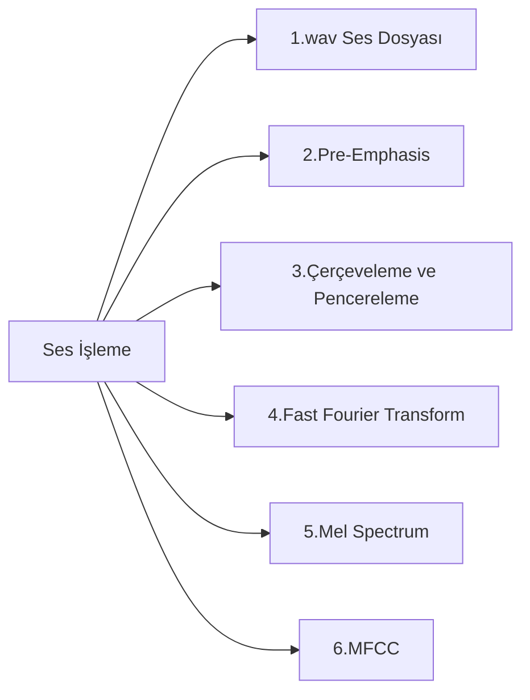
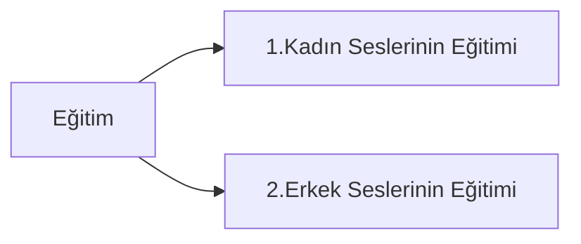
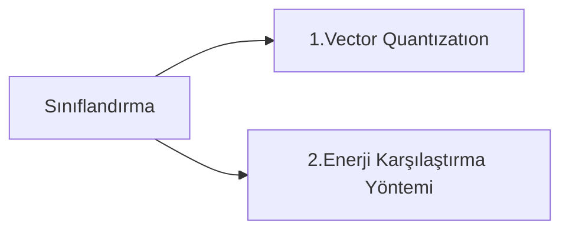

# Giriş
**Konuşma**, sahip olduğu zengin boyutlu karakterinden dolayı insanlar arasındaki iletişimin en kolay ve doğal şeklidir. Konuşma sırasında dinleyiciye yalnızca kelimeler iletilmez. Aynı zamanda konuşmacı hakkında **kimlik**, **yaş**, **cinsiyet**, **ruh hali** gibi bilgilerde iletilir. İnsanlar arasındaki bu iletişimin bilgisayarla da kurulması için yoğun çalışmalar yapılmaktadır. Bu bilgiler değişik amaçlar için kullanılır. Özellikle biyometrik sistemlerde sesin kullanımı hem maliyet hem de kullanım kolaylığı açısından avantaj sağlamaktadır.

Örneğin ortama yerleştirilen bir mikrofon aracılığıyla kişinin haberi bile olmadan ses kaydı alınabilir ve sistem uygulanabilir. Bu tarz sistemler savunma sektöründe hem özel hem de devletler tarafından kullanılmaktadır. Ayrıca uzaktan erişim kolaylığı da ses biyometrisinin avantajlarından bir diğeridir. Bu çalışmada ses dalgasının içinde barındırdığı kişisel bilgilerden konuşmacı cinsiyetinin otomatik olarak belirlenmesi amaçlanmaktadır.
# Cinsiyete Dayalı Ses Analizi
Bu çalışmada konuşmacının cinsiyet grubunun otomatik olarak belirlenmesi ve ses analizi konusu ele alınmıştır.
>Kullanım Alanları
 - Başta ticari medikal ve adli olmak üzere geniş bir uygulama alanına sahip olan otomatik yaş ve cinsiyet tanıma sistemleri doğrudan bir servisin seçiminde kullanılabileceği gibi farklı tanıma sistemlerinde ön işlem olarak da kullanılır. 

  Ancak konuşma sinyali, görüntü sinyali gibi ayırt edilebilecek faktör sayısı azdır ve işlenmesi çok daha zordur. Konuşma sinyali oldukça değişkendir ve başarılı bir sistemin gerçekleştirilmesi için konuşmayı etkileyen tüm faktörlerin değerlendirilmesi gerekir. Bu çalışmada konuşmacı cinsiyetinin **metinden bağımsız** olarak belirlenmesi amaçlanmaktadır. 
  >Önerilen sistem iki bölümden oluşmaktadır. 
  - Birinci bölüm olan **eğitim** aşamasında deneklerden alınan ses kayıtlarından öznitelik vektörü hesaplanır.
Çalışmada öznitelik vektörü olarak **MFCC(Mel Frequency Cepstral Coefficients)** kullanılmıştır. Elde edilen MFCC öznitelik vektörü **VQ (Vector Quantization)** ve **Enerji Karşılaştırma yöntemiyle** sınıflandırılır ve veri tabanına ayrı ayrı kaydedilerek eğitim aşaması tamamlanır.
- İkinci bölüm olan **test** aşamasında konuşmacı cinsiyeti bilinmeyen ses kayıtları giriş olarak alınır ve eğitim aşamasındaki gibi öznitelik vektörü hesaplanır. Elde edilen öznitelik vektörü eğitim veri tabanındaki verilerle kıyaslanarak erkek ve bayan sınıflar için ortalama bir uzaklık değeri hesaplanır. Bu uzaklık değerlerinden küçük olanı test verisinin hangi sınıfa ait olduğunu belirtir.

Çalışmada, yaygın olarak kullanılan alınan **.wav** dosya formatındaki sesin byte byte işlenerek, analizi, bit kadar ince detaylarına girilmesi ve bunların çeşitli öznitelik çıkarmadan tutun da ön vurgulamaya kadar bu kısımlar üzerinde yoğun olarak çalışılmıştır. Sınıflandırma yöntemi olarak **özdeğer vektörü** çıkarma daha sonrasında **ön-vurgulama (Pre-emphasis)**, **çerçeveleme**, **pencereleme**, **fast freguence transform(fft)**, **Mel spektrum**, **Mel Cepstrum** konuları tek tek ele alınmıştır ve oluşturulan sisteme uygulanarak elde edilen konuşma sinyallerinin ayırımı, vektör haline getirilip **VQ** ve **Enerji katsayıları** kıyaslanıp, sınıflandırılarak başarılı bir şekilde gerçeklenmiştir

## Kullanılan Yöntem Diagramları

Ses işleme akış diyagramı:

Eğitim akış diyagramı:

Sınıflandırma akış diyagramı:

